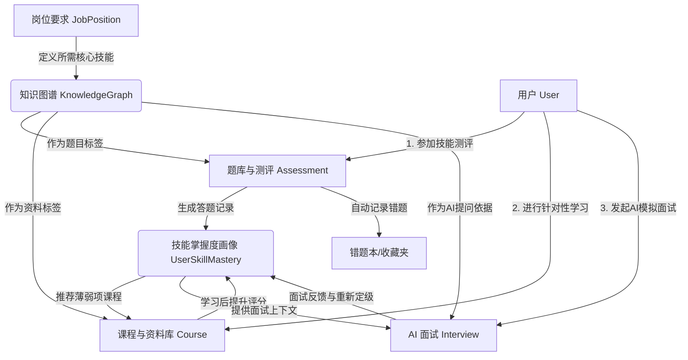

# MianMianMaster 面面大师后端业务流程说明

## 1. 项目概览

MianMianMaster（面面大师）是一个 AI 驱动的面试准备、技能评估与学习成长的综合性平台。平台通过构建底层“知识图谱（Knowledge Graph）”和“岗位技能模型（Job Position）”，将“AI面试（Interview）”、“技能测评（Assessment）”和“针对性学习（Learning）”三大核心业务模块串联，实现用户从“摸底评估”到“精准学习”再到“模拟面试”的闭环成长。

项目采用了分层架构设计（Router -> Service -> DB），使用 FastAPI + SQLAlchemy 2.0 构建，依赖 PostgreSQL 和 Redis，遵循严格的权限控制与代码规范。

---

## 2. 核心实体与业务模块

平台主要由以下几个核心模块构成：

1. **用户与权限模块 (`src/models/user.py`)**
   - 包含用户基本信息（`User`）、个人画像（`UserProfile`）、角色（`Role`）与权限（`Permission`）。
   - 支持短信验证码登录/注册（`SmsVerification`）及基于 RBAC 的动态权限控制。
2. **业务与岗位配置模块 (`src/models/business.py`)**
   - **知识图谱（`KnowledgeGraph`）**：定义各个技能点的父子层级关系，形成全平台的技能树基石。
   - **岗位模型（`JobPosition`）**：定义岗位及其所需的知识图谱技能点（带有权重参数）。
   - **AI与面试配置（`AIStrategy`, `InterviewConfig`）**：定义 AI 面试官的模型参数、系统提示词以及音视频的房间配置。
3. **测评引擎模块 (`src/models/assessment.py`)**
   - 包含测评试卷（`Assessment`）与题目（`Question`）。
   - 记录用户测评过程（`UserAssessmentRecord`）并计算用户的各节点技能掌握度（`UserSkillMastery`）。
4. **学习成长模块 (`src/models/learning.py`)**
   - 提供针对性的课程（`Course`）及资料（`CourseMaterial`）。
   - 跟踪用户学习进度（`UserLearningProgress`）、错题本（`UserWrongQuestion`）、题目收藏（`UserQuestionCollection`）。
   - 包含成就徽章系统（`Badge`, `UserBadge`）以提供游戏化激励。
5. **消息与系统模块 (`src/models/notification.py`, `src/models/system.py`)**
   - 负责站内信通知（`Notification`）、系统全局配置（`SystemConfig`）以及核心操作的审计日志（`AuditLog`）。

---

## 3. 核心业务流程流转

### 3.1 平台基础数据构建流程 (管理员/教研视角)
1. **构建知识图谱**：教研人员在后台创建知识图谱节点，梳理如“Python基础”、“微服务架构”、“数据库锁”等层级技能点。
2. **定义岗位模型**：创建目标岗位（如“高级后端工程师”），并将其与知识图谱节点关联，设定各个技能点的权重。
3. **配置面试策略**：为特定岗位创建对应的音视频面试配置（如限时60分钟）和专属 AI 面试官策略（设定大模型的 System Prompt 和 Temperature）。
4. **建设题库与课程**：
   - 基于图谱节点录入各种题型的题目（单选/多选/简答），并组装成测评试卷。
   - 挂载对应的视频、文档作为课程资料，供用户补齐短板。

### 3.2 用户注册与初始化流程
1. **账号注册**：用户通过手机号短信或邮箱/密码注册。
2. **完善画像**：用户填写个人资料（`UserProfile`），包括目标求职岗位、工作年限、教育背景等。
3. **基线初始化**：系统根据目标岗位，初始化该用户对应的技能树基线结构，准备后续的数据跟踪。

### 3.3 技能摸底与画像生成流程 (Assessment)
1. **发起测评**：用户根据目标岗位，选择对应的测评试卷进行摸底测试。
2. **完成答题**：用户提交试卷，系统根据题目绑定的正确答案自动判分，生成测评记录（`UserAssessmentRecord`）。
3. **更新技能画像**：系统根据答题对错情况和题目的知识图谱关联，更新用户的技能掌握度得分（`UserSkillMastery`）。
4. **自动收录错题**：答错的题目自动加入用户的错题本（`UserWrongQuestion`），供后续复习巩固。

### 3.4 针对性学习与成长流程 (Learning)
1. **智能推荐课程**：系统依据用户的“技能掌握度（薄弱项）”，推荐关联该知识图谱节点的课程或资料（`CourseMaterial`）。
2. **课程学习跟踪**：用户观看视频或阅读文档，系统实时记录并更新学习进度（`UserLearningProgress`）。
3. **复习与巩固**：用户随时进入错题本或收藏夹进行复习。当同一错题被正确作答多次后，系统会将其标记为“已掌握”。
4. **成就解锁激励**：当用户完成特定课程或在测评中达到某项分数阈值，系统颁发成就徽章（`Badge`）。

### 3.5 AI 模拟面试闭环流程 (Interview)
1. **发起面试**：用户觉得准备充分后，选择一个目标岗位发起 AI 模拟面试会话（`InterviewSession`）。
2. **调度 Agent**：系统分配相关的面试配置与 AI 策略，调度对应的 AI Agent（记录于 `AgentState`）。
3. **动态面试进行中**：
   - AI 面试官根据岗位的技能要求和该用户当前的技能掌握度（`UserSkillMastery`），动态生成具有针对性的面试问题。
   - 记录面试会话的状态流转（scheduled -> in_progress）。
4. **面试完成与定级反馈**：
   - 面试结束后，AI Agent 根据用户回答的录音/文本进行综合打分，生成详尽的面试反馈报告。
   - 系统根据面试中暴露的新知识盲点或亮点，再次更新用户的技能掌握度。
5. **消息通知**：面试报告生成完毕后，系统触发站内信（`Notification`）告知用户查看结果。

---

## 4. 业务数据流转全景图

## 5. 关键表关系说明

- **用户扩展**：`users` 1:1 `user_profiles`，`users` 1:N `user_roles`
- **岗位与图谱**：`job_positions` N:M `knowledge_graphs` (通过关联表 `job_skills` 并附加权重)
- **图谱关联项**：`knowledge_graphs` 1:N `questions` (题库), 1:N `course_materials` (课程资料)
- **测评闭环**：`assessments` 1:N `questions`；`users` 1:N `user_assessment_records`, 1:N `user_skill_mastery`
- **面试闭环**：`interview_sessions` 强关联 `users` (候选人), `interview_configs` (音视频配置), `ai_strategies` (AI模型提示词与参数)
